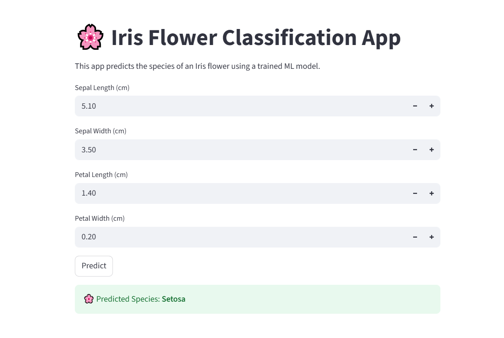
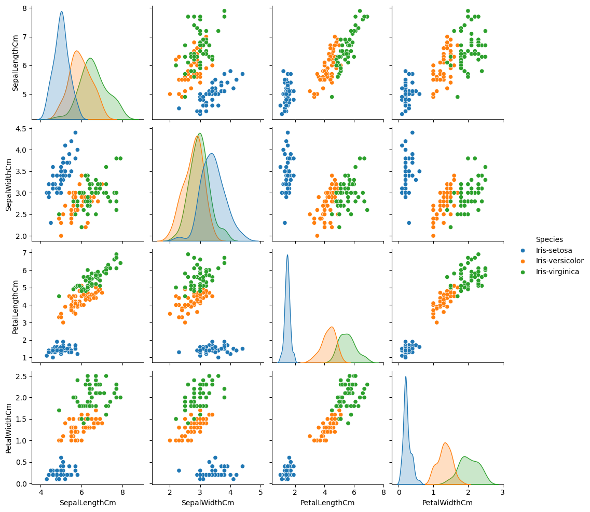
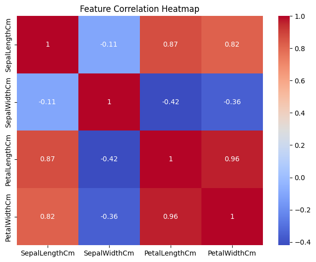
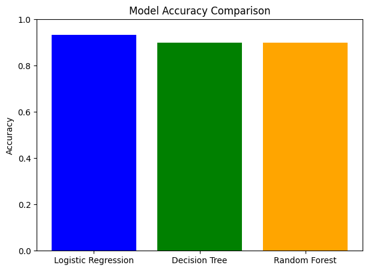

# 🌸 Iris Flower Classification

This project is part of the **CodeAlpha Data Science Internship (Task 1)**.  
The objective is to classify iris flowers into three species (*Setosa*, *Versicolor*, *Virginica*) using their sepal and petal measurements,  
and deploy the trained model as an **interactive Streamlit web app**.

---

## 📑 Table of Contents
- [Project Structure](#-project-structure)
- [Setup & Installation](#-setup--installation)
- [Project Workflow](#-project-workflow)
- [Exploratory Data Analysis (EDA)](#-exploratory-data-analysis-eda)
- [Preprocessing](#-preprocessing)
- [Model Training & Evaluation](#-model-training--evaluation)
- [Model Saving](#-model-saving)
- [Streamlit Integration](#-streamlit-integration)
- [Project Summary](#-project-summary)
- [Tech Stack](#-tech-stack)
- [App Preview](#-app-preview)

---

## 📂 Project Structure
---

TASK_1_Iris_Flower_Classification/
│── .venv/ # Virtual environment
│── archive/ # archive folder (Iris.csv from Kaggle)
│── models/ # (Will be used to save trained models)
│── results/ # (Will be used to save results & plots)
│── Iris_Flower.ipynb # Main Jupyter Notebook
│── requirements.txt # Project dependencies
│── README.md # Project documentation

---

## ⚙️ Setup & Installation

1. **Clone / Download Repository**  
   ```bash
   git clone <repo-link>
   cd TASK_1_Iris_Flower_Classification

2. **Download Dataset**  
   - Download the **Iris.csv** dataset from Kaggle.  
   - Place it inside the `archive/` folder of this project.  

3. **Create Virtual Environment**  
   ```bash
   python -m venv .venv

## Activate Environment
  - Windows (PowerShell)
  - .venv\Scripts\activate

  - Linux/Mac
  - source .venv/bin/activate

## Install Dependencies
  - pip install -r requirements.txt

## Run Jupyter Notebook
  - jupyter notebook

## 📂 Project Workflow

1. **Environment Setup ✅**

 - Created `.venv` (virtual environment).  
 - Installed required libraries from `requirements.txt`.  
 - Added custom Jupyter kernel for this project.  

2. **Data Loading ✅**

 - Loaded dataset from Kaggle (`Iris.csv`).  
 - Verified **150 rows × 6 columns** with no missing values.  

3. **Exploratory Data Analysis (EDA) ✅**

 - Dataset Overview (info, describe).  
 - Checked for missing/null values → none found.  
 - Species distribution → Balanced (50 samples each).  
 - Pairplot → *Setosa* is clearly separable, *Versicolor* & *Virginica* overlap.  
 - Correlation Heatmap → Petal Length & Petal Width strongly correlated (~0.96).  
 - **Conclusion:** Petal features are the most informative. 

4. **Preprocessing ✅**

 - Dropped `Id` column.  
 - Encoded `Species` labels into numeric (0 = Setosa, 1 = Versicolor, 2 = Virginica).  
 - Split dataset into **80% Training / 20% Testing**.  
 - Standardized features using `StandardScaler`.  

5. **Model Training & Evaluation ✅**

 - Trained **Logistic Regression, Decision Tree, Random Forest**.  
 - Evaluated with **Accuracy, Confusion Matrix, Classification Report**.  
 - **Results:**  
   - Logistic Regression → **93.3% accuracy** (best).  
   - Decision Tree → **90% accuracy**.  
   - Random Forest → **90% accuracy**.  
 - All models classified *Setosa* perfectly. Minor misclassifications between *Versicolor* & *Virginica*.  

6. **Model Saving ✅**

 - Saved trained models (.pkl) inside /models/.  
 - Saved StandardScaler for preprocessing.  
 - Ensures reusability for deployment without retraining.

7. **Streamlit Integration ✅** 
 - Created app.py with Streamlit. 
 - Loaded Logistic Regression model + Scaler. 
 - On prediction → displayed species (Setosa / Versicolor / Virginica).
 - **Final app runs with:**
   - streamlit run app.py

## 📑 Project Summary
 - This project built a complete ML pipeline for Iris Flower Classification:
   - Data → Preprocessing → Model Training → Evaluation → Model Saving → Streamlit Deployment
   - Achieved 93% accuracy with Logistic Regression.
   - Delivered an interactive web app for real-time flower classification.
 - ✅ With this, Task 1 is fully completed and deployment-ready 🚀

## 🛠️ Tech Stack

 - **Language:** Python  
 - **Libraries:** pandas, numpy, matplotlib, seaborn, scikit-learn  
 - **Environment:** VS Code, Jupyter Notebook  
 - **Version Control:** GitHub  

## 🖼️ App Preview

⚡ Umer, ab ye README.md **GitHub pe bilkul professional lagega** → jaise ek real-world project ka documentation hota hai ✅  

Chaho to mai tumhe ek **checklist for GitHub upload** bhi bana dun?

## 🖼️ Screenshots

### 1. Streamlit App Preview


### 2. Pairplot (EDA)


### 3. Correlation Heatmap


### 4. Streamlit App Preview



